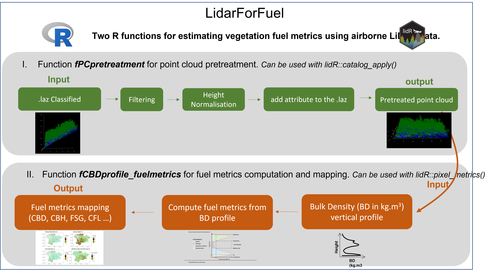
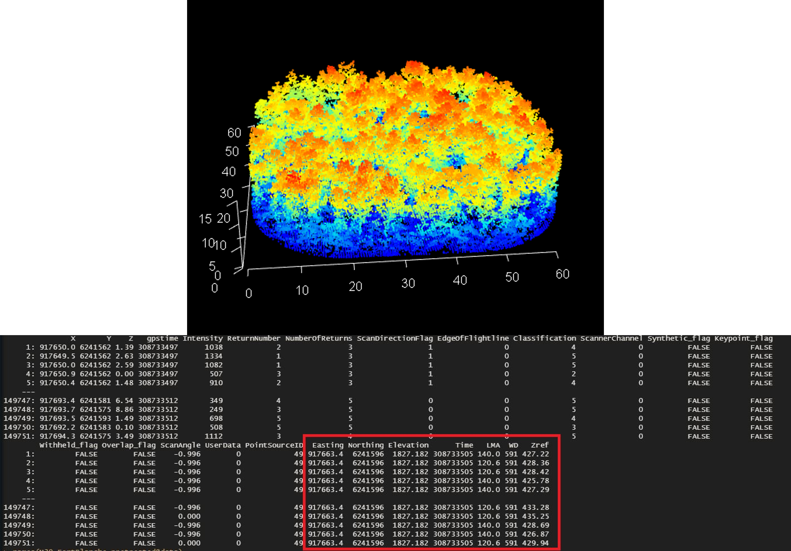

# lidarForFuel

This README aims to describe how to use a set of tools to implement the method outlined in the paper [Unlocking the Potential of Als Data for Direct Assessment of Fuel Load and Vertical Structure](https://papers.ssrn.com/sol3/papers.cfm?abstract_id=4779351). We provide here some detailed information about the approach but note that the two functions are made in a R package with help files properly done with examples that should help the other to use them.

## Install LidarForFuel

The latest version from Github (in development):

```{r}
install.packages("remotes") 
remotes::install_github('oliviermartin7/LidarForFuel')
```

To use it :

```{r}
library("LidarForFuel")
```

## Global description of the approach

lidarforfuel aims to compute fuel metrics from airborne LiDAR data and map them at a large scale. Currently, two R functions have been developed: 1) fPCpretreatment: pretreatment of a point cloud and 2) fCBDprofile_fuelmetrics: computing fuel metrics. These functions can be used either at the plot scale for specific analyses on small areas or at a large scale using a catalog of LiDAR tiles from the lidR package.



It is important to note that the function fCBDprofile_fuelmetrics for computing fuel metrics/profile needs as entry a pretreated point cloud obtained with the fPCpretreatment.

## fPCpretreatment

Function for preprocessing las (laz) files for use in fCBDprofile_fuelmetrics. This can be used in the catalog_apply lidR function. The pretreatment consists of normalizing the point cloud and adding various attributes: Plane position for each point (easting, northing, elevation), LMA (leaf mass area) and wood density (WD) by intersecting the point cloud with an LMA and WD map or by providing LMA and WD values.

It should be noted that LMA and WD can vary widely horizontally within a given plot/pixel if several dominant species are present in the plot (e.g. mixed stands), so an average value can be used. Also, LMA and WD vary strongly in the vertical direction (dominant species versus species in the understory), and one could specify the LMA and WD values in the argument LMA_bush and WD_bush, which assigns an LMA and a WD value for vegetation below 2 m. In a later version, it would be possible to adapt these values to the layers specified by the user.



## fCBDprofile_fuelmetrics

to do

## 
