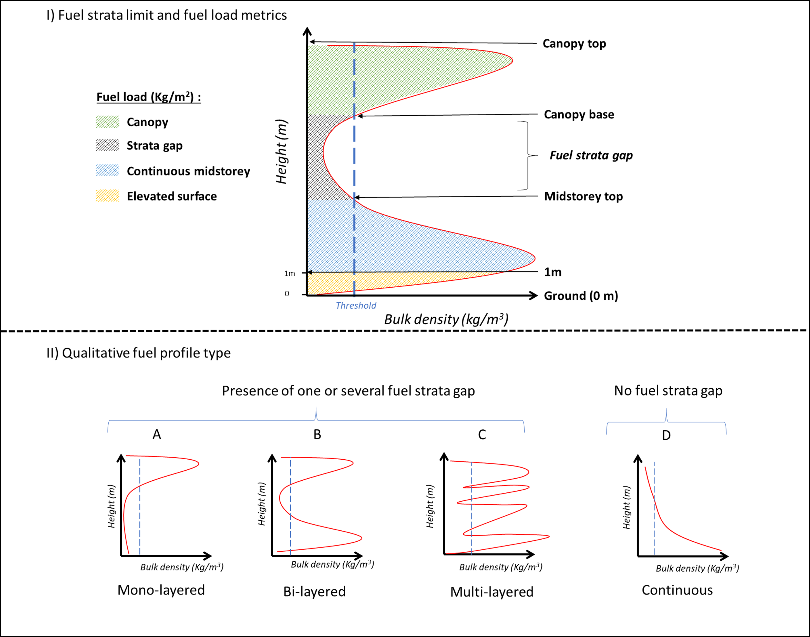
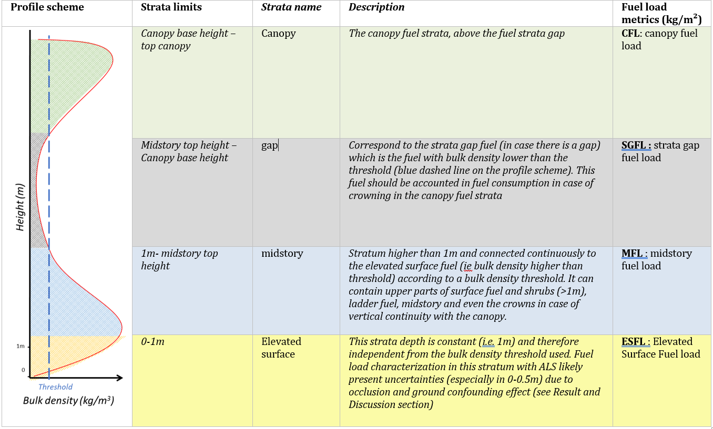

# lidarForFuel

This README aims to describe how to use a set of tools to implement the method outlined in the paper [Unlocking the Potential of Als Data for Direct Assessment of Fuel Load and Vertical Structure](https://papers.ssrn.com/sol3/papers.cfm?abstract_id=4779351). We provide here some detailed information about the approach but note that the two functions are made in a R package with help files properly done with examples that should help users.

## Install LidarForFuel

The latest version from Github (in development):

```{r}
install.packages("remotes") 
remotes::install_github('oliviermartin7/LidarForFuel')
```

To use it :

```{r}
library("LidarForFuel")
```

## Global description of the approach

lidarforfuel aims to compute fuel metrics from airborne LiDAR data and map them at a large scale. Currently, two R functions have been developed: 1) fPCpretreatment: pretreatment of a point cloud and 2) fCBDprofile_fuelmetrics: computing fuel metrics. These functions can be used either at the plot scale for specific analyses on small areas or at a large scale using a catalog of LiDAR tiles from the lidR package.


It is important to note that the function fCBDprofile_fuelmetrics for computing fuel metrics/profile needs as entry a pretreated point cloud obtained with the fPCpretreatment.

## fPCpretreatment

Function for preprocessing las (laz) files for use in fCBDprofile_fuelmetrics. This can be used in the catalog_apply lidR function. The pretreatment consists of normalizing the point cloud and adding various attributes: Plane position for each point (easting, northing, elevation), LMA (leaf mass area) and wood density (WD) by intersecting the point cloud with an LMA and WD map or by providing LMA and WD values.

It should be noted that LMA and WD can vary widely horizontally within a given plot/pixel if several dominant species are present in the plot (e.g. mixed stands), so an average value can be used. Also, LMA and WD vary strongly in the vertical direction (dominant species versus species in the understory), and one could specify the LMA and WD values in the argument LMA_bush and WD_bush, which assigns an LMA and a WD value for vegetation below 2 m. In a later version, it would be possible to adapt these values to the layers specified by the user.


## fCBDprofile_fuelmetrics

Function for i) inverting the point cloud into a bulk density vertical profile and ii) derive from the vertical bulk density profile fuel metrics useful to assess fire risk through (e.g canopy fuel load, midstorey and surface fuel load, canopy base height, fuel strata gap...). For large scale analysis it is particularly relevant to use this function with lidR::pixel_metrics function. However it is also possible to use it directly with a laz point cloud of a specific forest plot or area. More details :

```{r}
?fCBDprofile_fuelmetrics
```

Below a figure illustrating a theoretical vertical bulk density profile from which height boundaries that define surface, midstorey and canopy strata can be identified. These height are identified using a bulk density threshold that can be set by the used (argument "threshold") and several fuel metrics can therefore be extracted. Two types of metrics are derived. 1) Quantitative metrics on the upper part of the figure and 2) a qualitative metric describing the shape of the vertical profile (A, B, C and D corresponding to the 1, 2, 3 and 4 value of the variable "Profil_Type_L" or Band 2 from the output).



Note that in case of continuity (Profile type "D" or "4"): Canopy Base Height (CBH) =0; Fuel Strat Gap (FSG) = 0; Canopy Fuel Load (CFL) =0 and Midstorey Fuel Load (MFL) = Total fuel load from 1m to the top of the canopy. The Table below describes more precisely the different strata and their rationale.



If used with lidR:pixel_metrics, the output of the function is a raster with 173 Bands. The first 22 Band are fuel metrics, vertical structural metrics and properties or parameters used to compute them :

1:"Profil_Type" : Detailed Fuel profile type (to described avoid using this one for now)

2:"Profil_Type_L": Fuel Profile Type (to use). 1 to 4 correponding to "A" to "D" on the figure

3:"threshold" : Bulk density threshold used to identify the limits

4:"Height" : Canopy height

5:"CBH": canopy base heighy

6:"FSG" : fuel strata gap

7:"Top_Fuel" : Canopy top according to bulk density threshold

8:"H_Bush" : Midstorey top height on the figure

9:"continuity" : Is it fuel profile type "D" or not (1 or 0)

10:"VCI_PAD" : vertical complexity index based on PAD profile

11:"VCI_lidr": vertical complexity index based on the point cloud (from lidR package)

12:"entropy_lidr" : entropy based on the point cloud (from lidR package)

13:"PAI_tot": Plant area density

14:"CBD_max" : Maximum bulk density value

15:"CFL" : Canopy fuel load

16:"TFL" : Total fuel load

17:"MFL" : Midstorey fuel load

18:"FL_1_3" : Fuel load in the strata 1 to 3 m

19:"GSFL": Gap strata fuel load

20:"FL_0_1": Elevated surface fuel load (strata 0-1m)

21:"FMA" : Fuel Mass Area. Needed to compute bulk density from PAD

22:"date" : Date of the point cloud based on the laz file.

The 150 following band correspond to bulk density in each layer of depth corresponding the depth set by the user with the argument "d".
