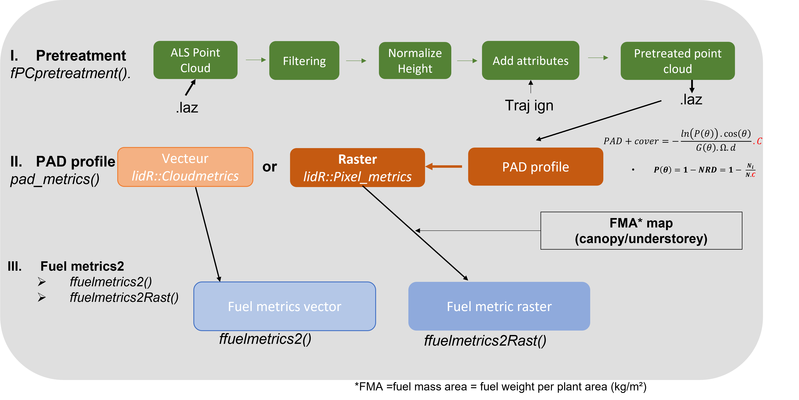
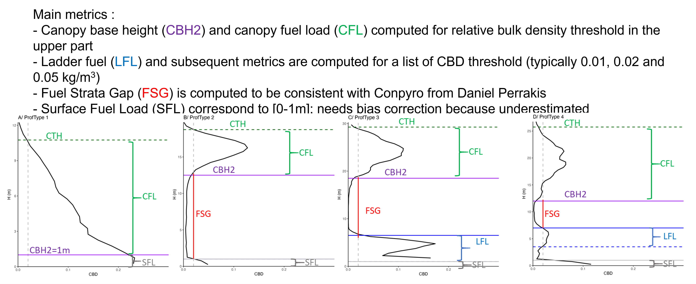

# lidarForFuel

This README aims to describe how to use a set of tools to implement the method outlined in the paper [Unlocking the potential of Airborne LiDAR for direct assessment of fuel bulk density and load distributions for wildfire hazard mapping](https://www.sciencedirect.com/science/article/pii/S0168192324004544). This approach has evolved since the paper and much more validation have been done as well as new methods for deriving fuel metrics. Contact the authors for more information.

## Install LidarForFuel

The latest version from Github (in development).

```{r}
install.packages("remotes") 
remotes::install_github('oliviermartin7/lidarforfuel', ref = 'Dev')
```

To use it :

```{r}
library("lidarforfuel")
```

## Global description of the approach

lidarforfuel aims to compute fuel metrics from airborne LiDAR data and map them at a large scale. Currently, three main R functions should be used: 1) fPCpretreatment: pretreatment of a point cloud to normalyze and add trajectories 2) pad_metrics: computing pad vertical profiles. 3) ffuelmetrics that compute fuel metrics from the pad vertical profile. This approach can be used at the plot scale for specific analyses on small areas or at a large scale using a catalog of LiDAR tiles from the lidR package for examples. 




## fPCpretreatment

```{r}
?fPCpretreatment
```

Function for pretreating the laz file before applying the rest of the approach. It consist in filtering some points, normalyzing the point cloud and add trajectories of the sensor to the laz.  

## pad_metrics

```{r}
?pad_metrics
```

Function for computing a PAD vertical profile as well as cover estimation at 2, 4 and 6m and date. This can be used in the catalog_apply lidR function. 

## ffuelmetrics

Function for deriving a bulk density (BD) profile from the PAD profile (pad_metrics function) and finally fuel metrics useful to assess fire behavior through (e.g canopy fuel load, surface fuel load, canopy base height, fuel strata gap : https://fireresearch.ca/conifer-pyrometrics/...). For large scale analysis it is particularly relevant to use this function with lidR::pixel_metrics function. However it is also possible to use it directly with a laz point cloud of a specific forest plot or area. More details :

```{r}
?ffuelmetrics2
```




## Code examples

In the present repository an example of how to run the full pipeline on LiDAR point clouds can be found in Code_examples/Processing_Pipeline_example_V1.0R
