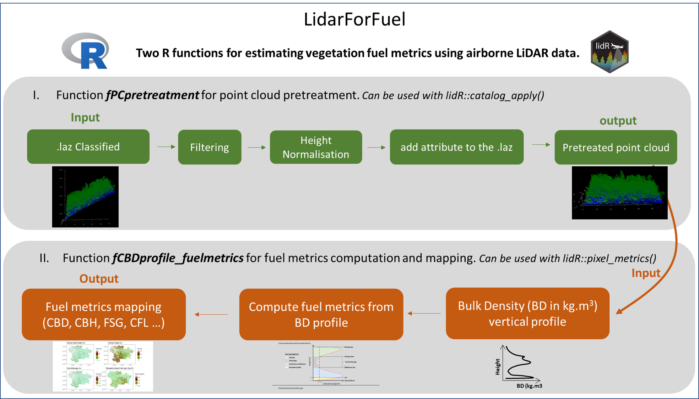

# lidarForFuel

This README aims to describe how to use a set of tools (R functions and an upcoming package) to implement the method outlined in the paper [Unlocking the Potential of Als Data for Direct Assessment of Fuel Load and Vertical Structure](https://papers.ssrn.com/sol3/papers.cfm?abstract_id=4779351)

## Global description of the approach

lidarforfuel aims to compute fuel metrics from airborne LiDAR data and map them at a large scale. Currently, two R functions have been developed: 1) pretreatment of a point cloud and 2) computing fuel metrics. These functions can be used either at the plot scale for specific analyses on small areas or at a large scale using a catalog of LiDAR tiles from the lidR package.



## fPCpretreatment
to do


## fCBDprofile_fuelmetrics

to do


## Install LidarForFuel


The latest version from Github (in development):
```{r}
install.packages("remotes")
remotes::install_github('oliviermartin7/LidarForFuel')
```

To use it :
```{r}
library("LidarForFuel")
```
